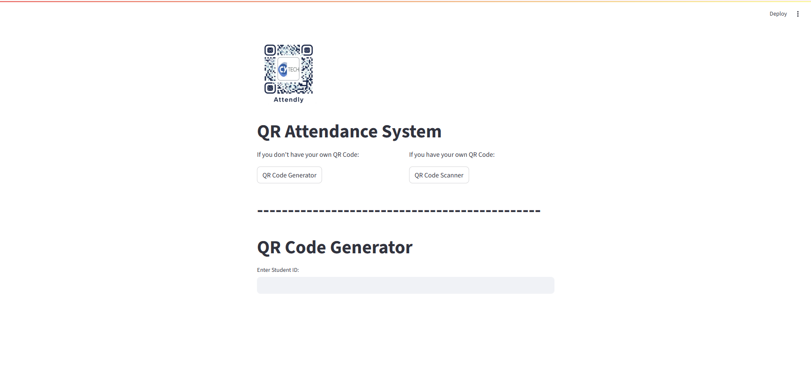
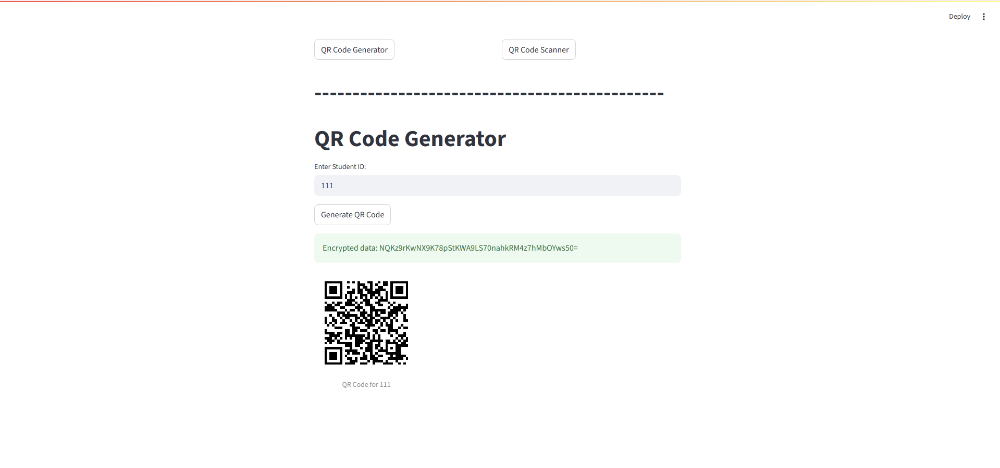
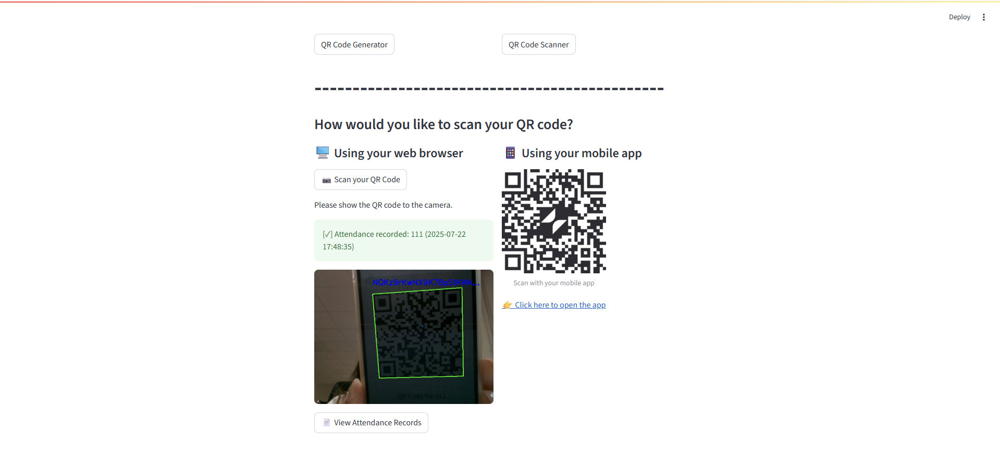
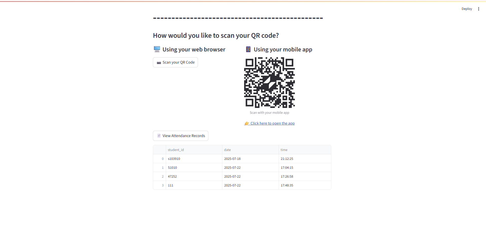

# 📘 프로젝트명 (Project Name)

Students Attendance System

---

## 📂 프로젝트 개요 (Overview)

1. Unique QR Code Generation
- The application generates a unique QR code for each student to ensure personalized identification.

2. Attendance Registration
- Students can efficiently and accurately register their attendance by scanning their QR codes.

3. Data Storage
- Attendance data can be stored in accessible formats such as CSV files or Google Sheets for easy access and review.

4. GDPR Compliance
- The application complies with GDPR (General Data Protection Regulation), ensuring that unencrypted personal data is never stored.
---

## ✨ 주요 기능 (Features)

- ✅ QR code generation
- ✅ Store attendance record automaticaly
- ✅ Available as a Mobile App
- ✅ Encrypt personal data

---

## 🛠️ 기술 스택 (Tech Stack)

- `Python`, `Steamlit`
- `OpenCV`, `pyzbar`, `cryptodome`

---

## 🚀 실행 방법 (Getting Started)

1. 프로젝트 클론

    ```bash
    git clone https://github.com/jenn2i/CYTECH_AttendanceWebapp
    cd CYTECH_AttendanceWebapp
    ```

2. 필요한 패키지 설치

    ```bash
    pip install -r requirements.txt
    ```

4. 실행

    ```bash
    streamlit run app.py
    ```

---

## 📸 데모


This is the main page.
You can both generate and scan QR codes.


When you put student ID into the input field, a QR code is generated with the encrypted student ID.


On the QR Scan page, pressing the "Scan your QR Code" button and scanning the QR code will be detect the encrypted student ID.


You can see the attendance records.
We will update it later to encrypt the records as well.

➕ Additional features
If you can't open webcam or you want to upload a photo from an app instead, opening the QR Page will launch the app automatically.

---
